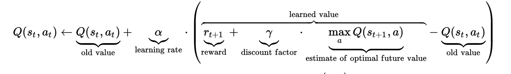

|  | # Christmas Challenge  | 

## Task Description
Santa Claus shall traverse a matrix grid world with his sledge from top to bottom.
The world looks as follows:

```
..## -->
#... -->
.#.. -->
...# -->
.#.. --> 

```
It consists of m rows an n columns, while an empty cell is marked by a "." and a polar bear is marked by a "#".
The goal is to jump from the start square in the top left corner (0,0) to the bottom, such that as few as possible 
polar bears are hit. 
The ice world is extended to the right by replicating the pattern (e.g. the first row ..## is replicated giving ..##..##..##..##... )
So jumps to the right are always possible this way.

The following jump actions are possible:

* (1,1) meaning one to the right, one to the bottom
* (1,3)
* (1,5)
* (1,7)
* (2,1)


1./2. Compute the number of polar bears hit when using only one (always the same) action.
3. Compute the number of polar bears hit when using the optimal route.
## Proposed Solution

I modelled the grid world as a binary matrix (0 for empty cells, 1 for polar bear cells).
In order to cope with the infinity of the world to the right I figured out how many colums are needed if always the 
maximum jump to the right is selected as action. This gives 7*#rows columns which are needed, so I replicated the pattern to this number
of rows right at the beginning.

1. Traversal with fixed steps is done by starting at (0,0), applying the step and checking if the matrix entry is a
polar bear square or not. The penalties are accumulated and returned.
2. Same as 1. only iteration through all steps is done.
3. I am sure there has to be some kind of "closed form" solution, but I modelled the problem as a reinforcement learning task using the Q-Learning algorithm for the following reasons:
    * We have a discrete state space (The states correspond to the matrix positions with an additional flag if it is a terminal state or not)
    * We have a discrete action space (sledge movements to the right)
    * We continuously receive rewards/penalties (-1) if we hit a polar bear
    * It is an episodic task, as we terminate when reaching the last matrix row
    
The basic idea is to do as many trajectories from top to bottom and updating a table (Q-Table) telling us which is the estimated 
reward we have to expect when taking a specific action in a specific state. When doing a trajectory we generally use this table
to select our action, nevertheless we do not want to get stuck in local minima. So we pick a random action with probability epsilon.
Doing so we guarantee that we also do "unusal" things sometimes to explore the world.
### Q-Learning algorithm

The update of the Q value (estimated reward for a state/action tuple) depends on the old Q value, the reward we get when reaching the new state and a discounted 
estimate of the maximum reward we can expect from the new state. For this task I used the following hyperparameters which gave me good results right from the beginning:
* alpha = 0.1
* gamma = 0.9
* epsilon (probability to take random action instead of Q-value guided action) = 0.01

My algorithm generates (Q-table guided) trajectories as long as there is no change in the number of hit polar bears for
a predefined number of trajectories or 0 hits are reached.

# Results
1./2.

```
Oh no. Hit 77 polar bears while doing only action (1, 1) and 322 steps. This means an average hit rate per step of 0.2391304347826087!
Oh no. Hit 280 polar bears while doing only action (1, 3) and 322 steps. This means an average hit rate per step of 0.8695652173913043!
Oh no. Hit 74 polar bears while doing only action (1, 5) and 322 steps. This means an average hit rate per step of 0.22981366459627328!
Oh no. Hit 78 polar bears while doing only action (1, 7) and 322 steps. This means an average hit rate per step of 0.2422360248447205!
Oh no. Hit 35 polar bears while doing only action (2, 1) and 161 steps. This means an average hit rate per step of 0.21739130434782608!
```

3. No polar bears are hit when using the proposed trajectory written as .txt file to the output folder.
